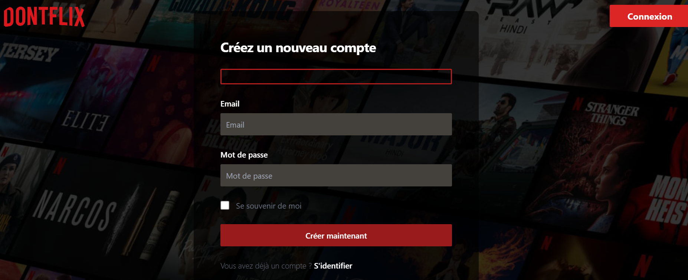
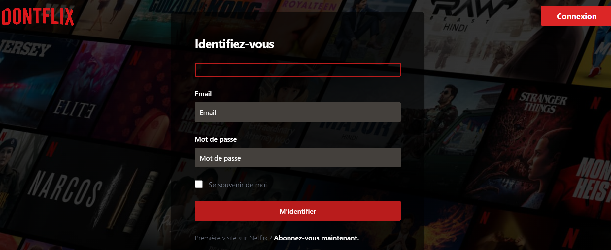
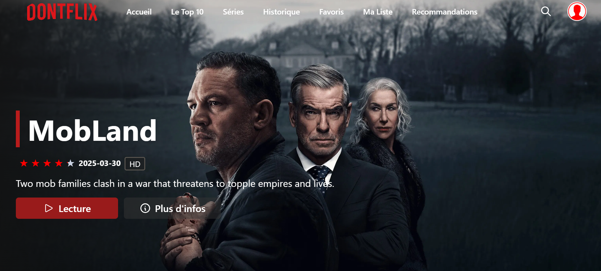
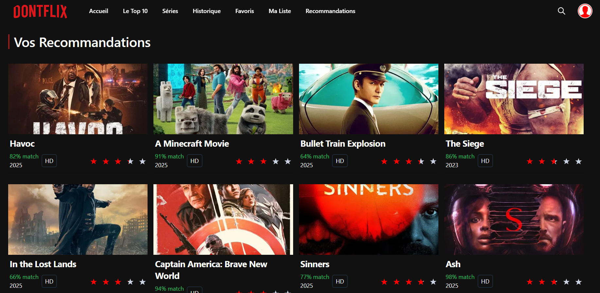
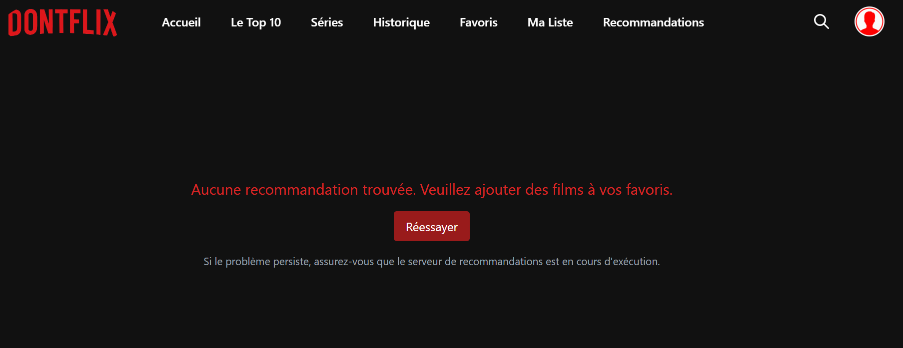
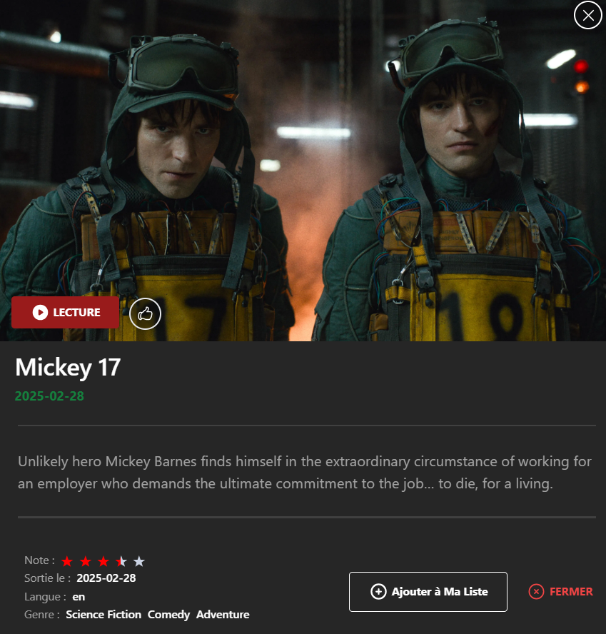
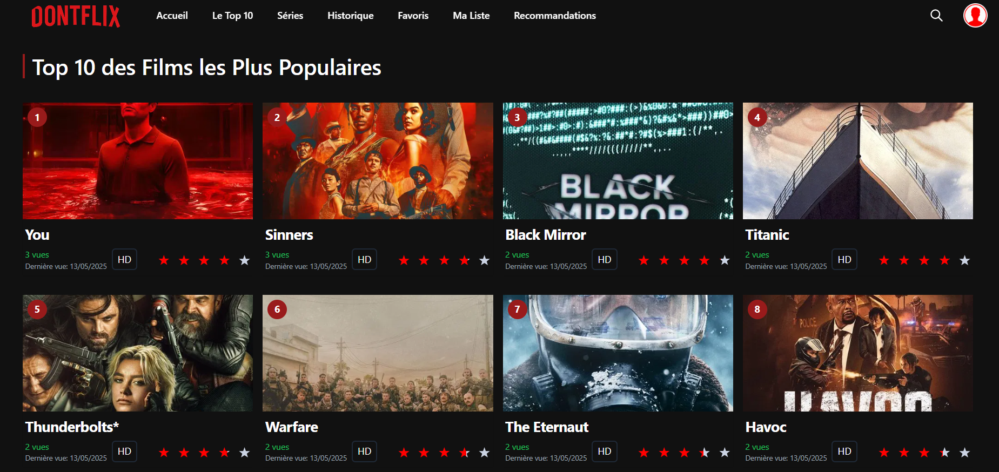
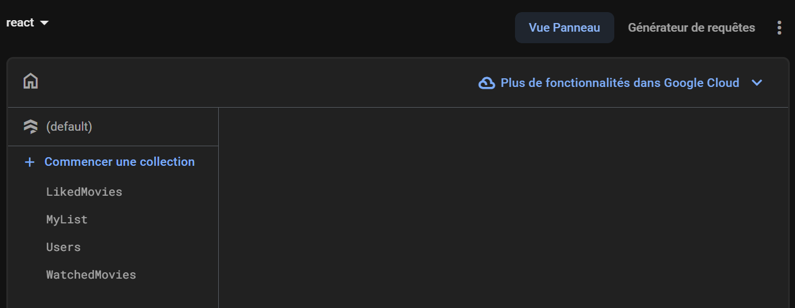

## Application Web de Recommandation de Films

Une application web de recommandation de films combinant un backend Python/Flask (API REST + Scikit-learn) et un frontend React.js, avec persistance des utilisateurs et des préférences via Firebase. Le système propose des recommandations personnalisées basées sur un mélange de filtrage collaboratif et de contenu, en s'appuyant sur Pandas et Scikit-learn.

### Démo visuelle












### Sommaire
- Présentation
- Architecture & Stack
- Fonctionnalités
- Prérequis
- Installation & Lancement (dev)
- API Backend
- Configuration & Sécurité
- Structure du projet
- Déploiement
- Licence

### Présentation
- **Contexte**: Système de recommandation intelligent utilisant des algorithmes de Machine Learning (filtrage collaboratif et de contenu via Scikit-learn).
- **Objectif**: Offrir une expérience moderne de découverte de films avec authentification, suivi des préférences et recommandations personnalisées.

### Architecture & Stack
- **Frontend**: React.js + Vite, TailwindCSS/SCSS, Axios
- **Backend**: Python, Flask (API REST), Flask-CORS
- **ML/Data**: Scikit-learn, Pandas, NumPy
- **Auth/DB**: Firebase (Auth, Firestore)
- **Autres**: TMDb API pour les métadonnées de films

```
Frontend (React/Vite)  <—— Axios ——>  Backend (Flask)  <——>  Firebase (Auth/Firestore)
                                            |\
                                            | ML (Scikit-learn, Pandas)
                                            | CSV / données locales
```

### Fonctionnalités
- **Interface moderne**: pages d'accueil, listes, carrousels, lecture bande-annonce, etc.
- **Authentification**: via Firebase (inscription, login, profil, historique).
- **Recommandations personnalisées**: endpoint dédié générant des suggestions selon l'historique/likes.
- **Top 10 ML**: endpoint exposant un classement basé sur des modèles ML.
- **Recherche et catégories**: intégration TMDb pour découvrir des contenus.


### Prérequis
- Node.js 16+ et npm
- Python 3.9+ (recommandé)
- Un projet Firebase (clé de service JSON pour Firestore/Auth)

### Installation & Lancement (dev)
1) Cloner le dépôt
```bash
git clone <URL_DU_DEPOT>
cd RcmdMoviesAML
```

2) Backend (Flask)
```bash
# Windows PowerShell
python -m venv .venv
.\.venv\Scripts\Activate.ps1
python -m pip install --upgrade pip
pip install -r recommenderBackend\requirements.txt

# Variables/Clés
# Placer la clé de service Firebase dans recommenderBackend/Key.json (NE PAS la commiter)

# Démarrer l'API (port 5000)
python recommenderBackend\server.py
```

3) Frontend (Vite)
```bash
npm install
npm run dev
# Ouvrir l'URL affichée (par défaut http://localhost:5173)
```

### API Backend
- Base: `http://localhost:5000`
- `GET /` — statut et liste des endpoints
- `POST /api/recommendations` — génère des recommandations personnalisées
  - body JSON: `{ "email": "user@example.com" }`
  - réponses: `{ status: 'success', recommendations: [...] }` ou `{ error: '...' }`
- `GET /api/top10` — retourne le Top 10 issu du module ML

### Configuration & Sécurité
- Ne pas commiter `recommenderBackend/Key.json`. La clé de service Firebase doit rester locale/CI.
- Variables sensibles: utilisez un `.env` (non commité) ou des variables d'environnement.
- Vérifiez Firestore: collections `Users`, `LikedMovies` utilisées par l'API de recommandation.

### Structure du projet (extrait)
```
RcmdMoviesAML/
  recommenderBackend/
    server.py
    recommender_csv.py
    top10_ml.py
    requirements.txt
    Key.json           # ignoré par Git (clé de service)
  src/
    Pages/Recommendations.jsx  # appelle l'endpoint /api/recommendations
    axios.js                    # baseURL TMDb, API front
    Constants/Constance.js      # clés TMDb, URLs image
  package.json
  vite.config.js
  README.md
```

### Déploiement
- **Frontend**: Vercel/Netlify (build `npm run build`).
- **Backend**: Render/Fly.io/VM. Configurer `FLASK_ENV=production`, clés Firebase via variables d'environnement. Ouvrir le port exposé par la plateforme.
- **CORS**: autoriser le domaine du frontend en production.

### Licence
Projet diffusé sous licence MIT (voir `LICENSE`).


